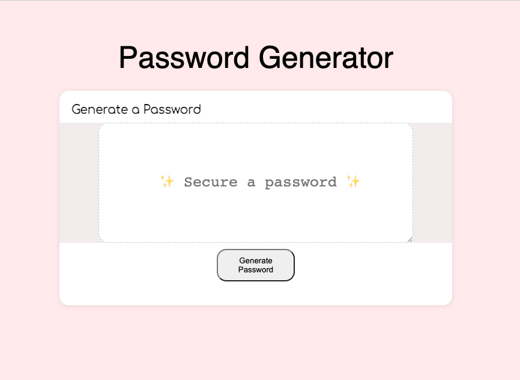

# PasswordGenerator

<!-- ```md

``` -->


## Description

An innovative and reliable Password Generator designed to create strong and secure passwords effortlessly.
With cyber threats on the rise, it's crucial to have robust passwords that can safeguard your personal information and online accounts.

## Table of Contents

- [Installation](#installation)
- [Usage](#Usage)
- [Credits](#Credits)
- [License](#License)
- [Badges](#Badges)
- [Features](#Features)

## Installation

```
git clone my repo!
```

## Usage

Launch my code and customize the password settings to your liking then click 'Generate Password'

Deployed website:
```
https://onelle11.github.io/PasswordGenerator/
```


## Credits

Developed by Onelle Fullente

## License

Password Generator is licensed under the MIT License. 

---

## Badges


## Features

- Generate highly secure passwords
- Advanced algorithms for ensuring randomness and security
- User-friendly interface for easy password generation

## How to Contribute

I welcome contributions to improve my Password Generator. If you'd like to contribute, please follow these steps:

1. Fork my repo
2. Create a new branch for your contribution
3. Make necessary changes and improvements
4. Test your changes thoroughly
5. Submit a pull request detailing the changes you've made
